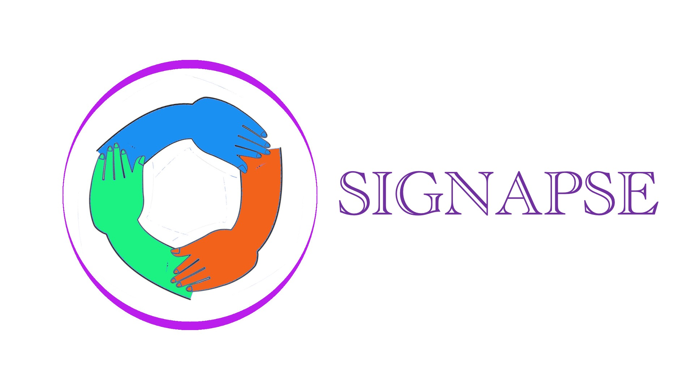

<!-- PROJECT LOGO -->
 

  
  
  <h1 align="center">Signapse</h1>

  

    Signapse is here to help you learn and practice sign language on an embedded device you can take anywhere!
     
     
     
    <a href="https://github.com/albanjoseph/Signapse/issues">Report Bug</a>
    ·
    <a href="https://github.com/albanjoseph/Signapse/issues">Request Feature</a>
  

<h3 align="center"></h3>

 

<!-- CONTACT -->

# About The [Project](link?)

- Signapse is an open source software tool for helping everyday people learn sign language for free!​

- Signapse acts as a teacher, helping students progress their learning. Users will be able to score points, complete challenges and view their live signing in our custom GUI.

 
 

# Social Media

·
 ·
<!--  -->
·

# Technologies

 </a>  </a> 
 
 

<!-- LICENSE -->

# License

Distributed under the GPL-3.0 License. See [`LICENSE`](https://github.com/albanjoseph/Signapse/blob/main/LICENSE) for more information.

# Contact Us
- 📫 Contact us: **signapse.glasgow@gmail.com**
- 🔭This project is being completed by a team of students at the University of Glasgow :

  * [Adam Frew](https://github.com/Saweenbarra) 
  * [Alban Joseph](https://github.com/albanjoseph)
  * [Lewis Russell](https://github.com/charger4241)
  * [Ross Gardiner](https://github.com/rossGardiner)