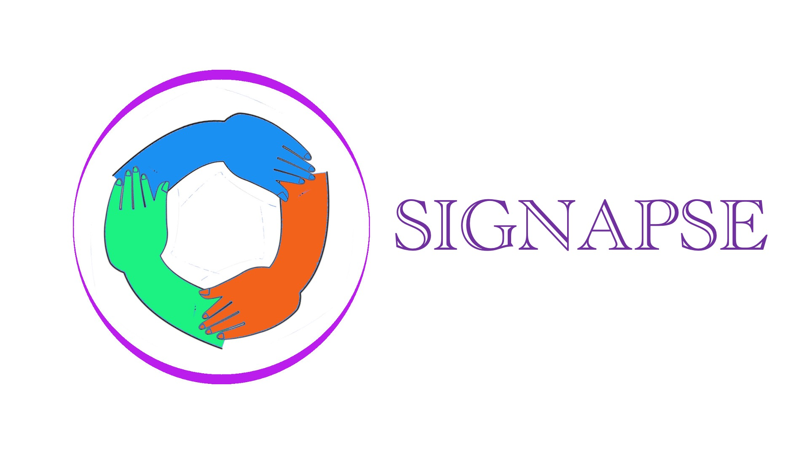

<!-- PROJECT LOGO -->
 

<h1 align="center">SIGNAPSE</h1>
<h3 align="center">Signapse is here to help you learn and practice sign language on an embedded device you can take anywhere!</h3>

  

<!-- CONTACT -->

## About The [Project](link?)

Little summary here would be shweet

  

    <a href="#">View Demo</a> 

    <a href="#">Report Bug</a>
 
    <a href="#">Request Feature</a>
  

- 📫 Contact us: **signapse.glasgow@gmail.com**
- 🔭This project is being completed by a team of students at the University of Glasgow :

* [Adam Frew](https://github.com/Saweenbarra) 
* [Alban Joseph](https://github.com/albanjoseph)
* [Lewis Russell](https://github.com/charger4241)
* [Ross Gardiner](https://github.com/rossGardiner)

<h3 align="left">Social Media:</h3>

